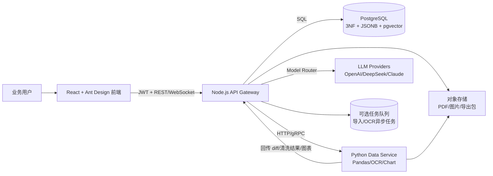
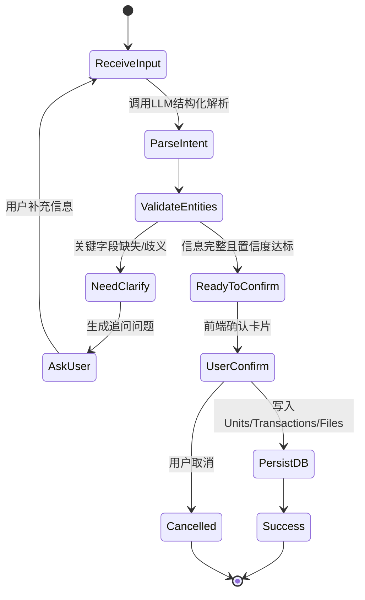

# 智能工抵台账管理系统 PRD 核心

## 整体架构

## AI 状态机

## 导入差异策略
- 表头映射：同义词字典 + 模糊匹配
- 主匹配键：`project + unit_code`
- 辅助键：`customer_name + amount + sign_date`
- 差异输出：`NEW/CHANGED/UNCHANGED/ERROR + field_diffs`

## 消歧策略
- 召回：别名字典 + 模糊检索 + 历史命中
- 判定：Top1 分数阈值与 Top1-Top2 差值阈值
- 交互：候选列表确认后再提交入库
